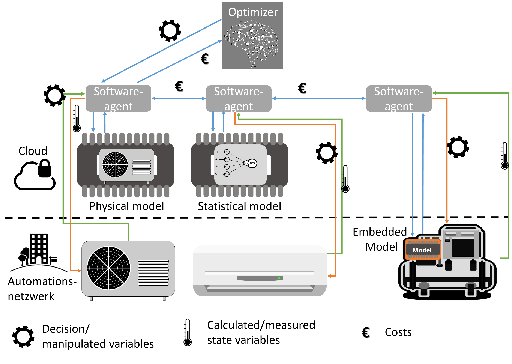
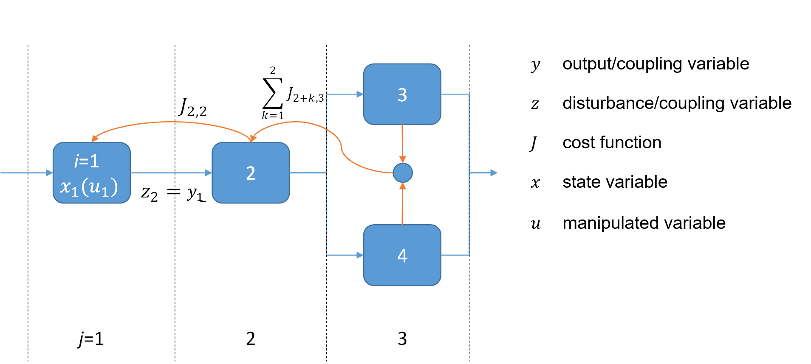
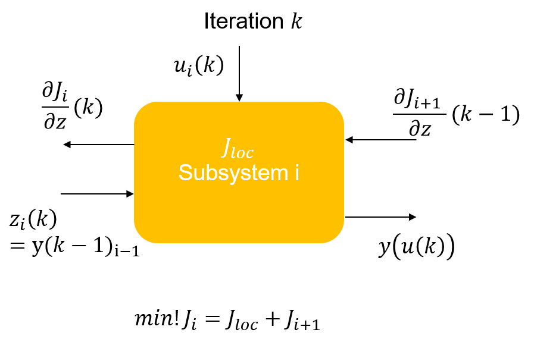

# pyDMPC Introduction

Models could play an increasingly important role in future building energy systems. Many model and optimization-based approaches, however, require the assumption of convexity and availability of a cost function gradient. We aim to develop approaches that function without these simplifying assumptions. Instead, we developed a flexible algorithm, in which each subsystem can be modelled using a different technique as long as the maximum computing time of the slowest model is still acceptable. Some of the models could be simulation models, potentially in a functional mockup unit, some could be simple characteristic fields and some could even be ‘external’, stored on the embedded controllers of HVAC components themselves.
In this framework, we have implemented two different algorithms: a non-iterative algorithm and an iterative algorithm.

The non-iterative approach, henceforth called BExMoC – Building Exergy-based Model Predictive Control – is based on a DMPC design that only requires communication between the current subsystem and its immediate up-stream neighbors. Instead of solving one error-prone optimization task of a central problem that considers optimization parameters of every single subsystem simultaneously, the central objective function is decomposed and each subsystem is attributed a suitable objective function of its own. These objective functions, however, cannot be solved without taking the influence on other subsystems into account. For that reason, the objective functions are constructed in such a way, that one subsystem’s objective always depends on the one of the downstream neighboring subsystem. Beginning with the last subsystem in a supply chain, the local objective functions are minimized successively for a set of pre-defined input conditions. Thus, look-up tables containing the local optimization results and corresponding decision values are generated and communicated to the immediate upstream neighbors. As soon as the upstream neighbor has received the look-up tables, its local objective function can be evaluated.
For the proposed algorithm, two cost functions can be selected: one aims to optimize operation costs, the other one focuses on minimizing the exergy destruction and loss. Whereas the operating costs are strongly influenced by fluctuating energy prices, the exergy loss depends only on the system's performance and the selection of the reference environment. Exemplarily, the local objective function is used in the following to show the equality of the central optimization problem and the decomposed problem.

The iterative algorithm is optimizes all subsystems in parallel in multiple iterations until convergence is achieved. It is henceforth called NC-DMPC, indicating the neighbor communication. In each iteration, the coupling variables, namely the disturbances z and the resulting cost gradient ∂J/∂z of the downstream neighbors are fixed.
However, due to the fact that the subsystem model is treated as a black box, the gradient of the minimized subsystem cost must be approximated in the current operating point. Thus, each subsystem is optimized twice and the gradient of the transformed minimized costs is obtained according to the following equation:

In the next iteration, the upstream subsystem uses this gradient to estimate the cost that its output would cause in the downstream subsystem. The cost can thus be added to the local cost function of that upstream subsystem.
In order to prevent that the upstream subsystem creates a disturbance that deviates too far from the range the cost gradient was calculated for, we define the piecewise function

The positive factors β_1 and  β_2 ensure that the cost increases significantly if the algorithm calculates a value for z(k) that deviates from the originally considered range. In the optimization process, this prevents the algorithm from considering solutions that include too large deviations.

